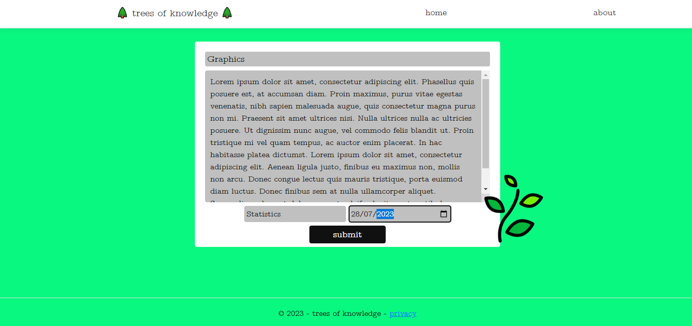
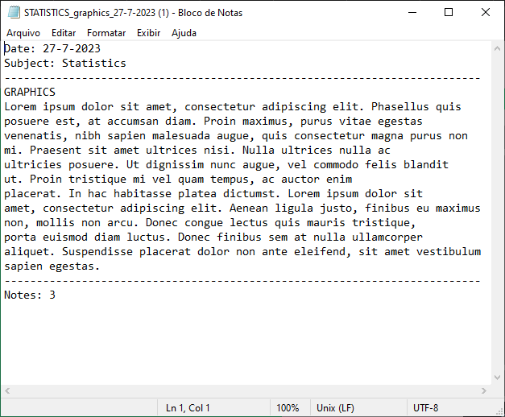

# Trees of Knowledge
## Description
🌲*Trees of Knowledge*🌲 is a simple and efficient note-taking app built using .NET that helps you organize your text notes effortlessly. By providing the subject, date, content, and title of a note, the web app generates formatted text files for your convenience.

 ## How to Use It
Run the app [located here 📁](bin/Release/net7.0/win-x64/publish/trees_of_knowledge.exe)

 
Click on 'Plant a Tree' to begin.

 
Input the required information. There are no character limits.

 
The note will be automatically generated. The filename follows the pattern **SUBJECT_title_dd-mm-yy**. The note text breaks the line every 10 words for a better user experience. At the bottom of the note, there is a download counter. 

## Future Updates
In the future, I plan to introduce a layout where all notes will be visually represented as trees. This feature will enable users to filter their notes by subject or date, providing a comprehensive overview of their 'forest of knowledge' on specific topics.
 
